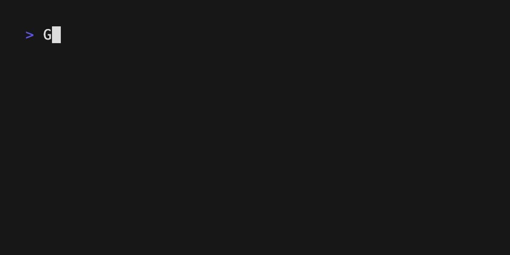

# zsh-secret-scanner



Block interactive shell commands that look like they contain secrets. When you press Enter, the command line is scanned with classic heuristics (regex rules). If something matches, execution is cancelled and a short reason is shown in the status line.

This is **oops prevention** for interactive `zsh` — not a security control. Scripts, `zsh -c`, other shells, and determined bypasses are out of scope.

## Requirements

- `zsh` 5.0+ (interactive use; ZLE `accept-line` wrapper)

## Installation

### oh-my-zsh

```bash
git clone https://github.com/subpop/zsh-secret-scanner.git \
    ${ZSH_CUSTOM:-~/.oh-my-zsh/custom}/plugins/zsh-secret-scanner
```

Add to `.zshrc` (before or with other plugins):

```zsh
plugins=(... zsh-secret-scanner)
```

### Manual

```bash
git clone https://github.com/subpop/zsh-secret-scanner.git ~/zsh-secret-scanner
echo 'source ~/zsh-secret-scanner/zsh-secret-scanner.plugin.zsh' >> ~/.zshrc
```

## Configuration

Set in `.zshrc` **before** the plugin loads:

| Variable | Default | Description |
|---|---|---|
| `ZSH_SECRET_SCANNER_ENABLED` | `1` | Set to `0` to disable scanning |
| `ZSH_SECRET_SCANNER_ALLOWLIST` | *(empty)* | Space-separated extended regexes; matching lines are not scanned |
| `ZSH_SECRET_SCANNER_EXTRA_PATTERNS` | *(empty)* | Extra rules: `("label\|regex" ...)` |

Example allowlist (ignore demo `curl` to a known doc host):

```zsh
ZSH_SECRET_SCANNER_ALLOWLIST='^curl https://example.com'
```

Example custom rule:

```zsh
ZSH_SECRET_SCANNER_EXTRA_PATTERNS=(
  'internal token|MYAPP_[0-9A-F]{32}'
)
```

To disable for the current session:

```zsh
export ZSH_SECRET_SCANNER_ENABLED=0
```

## Built-in rules

Rules live in `lib/patterns.zsh`. Defaults include:

- PEM / private key blocks
- GitHub, AWS, Slack, and Stripe-style token prefixes
- `Bearer` / `Authorization` headers with long tokens
- HTTP Basic payloads
- JWT-shaped strings
- `password=`, `api_key=`, and similar assignments with non-trivial values
- `*_API_KEY=…` on the command line (any non-empty value) and `$…_API_KEY` references

Tune or extend via `ZSH_SECRET_SCANNER_EXTRA_PATTERNS` or by editing `lib/patterns.zsh`.

## Tests

```bash
zsh test/test-scanner.zsh
```

## Limitations

- Only wraps interactive `accept-line`; non-interactive shells are not guarded.
- Only inspects the edited command line (`BUFFER`), not your environment. Keys injected by direnv, mise, or a prior `export` are invisible unless they appear in what you typed.
- Whole-line regex matching; no full shell parser (quoted words may still match substrings).
- False positives (long hex, tutorial `curl` examples) and false negatives (secrets only in env/files) are expected.
- Users can bypass by disabling the plugin, using another shell, or non-interactive invocation.

## License

MIT — see [LICENSE](LICENSE).
